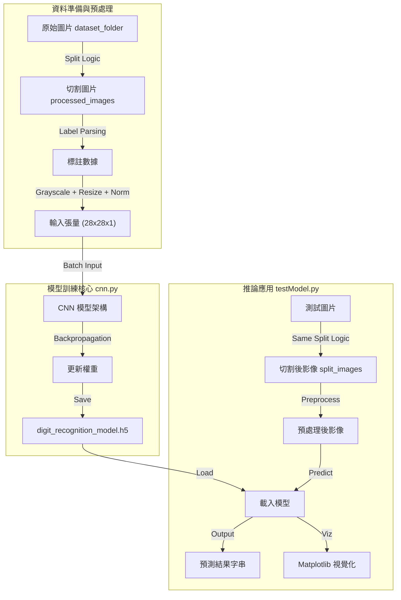
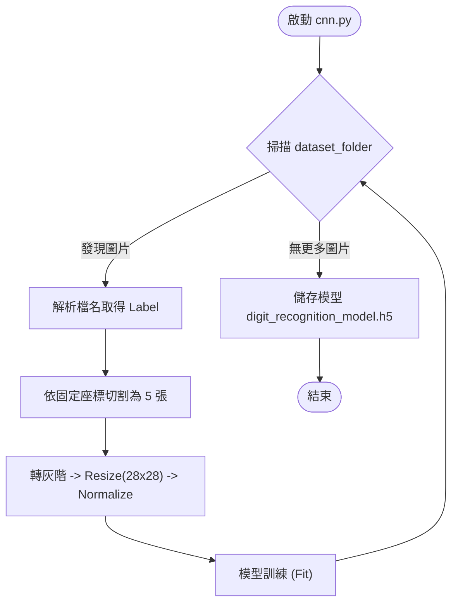
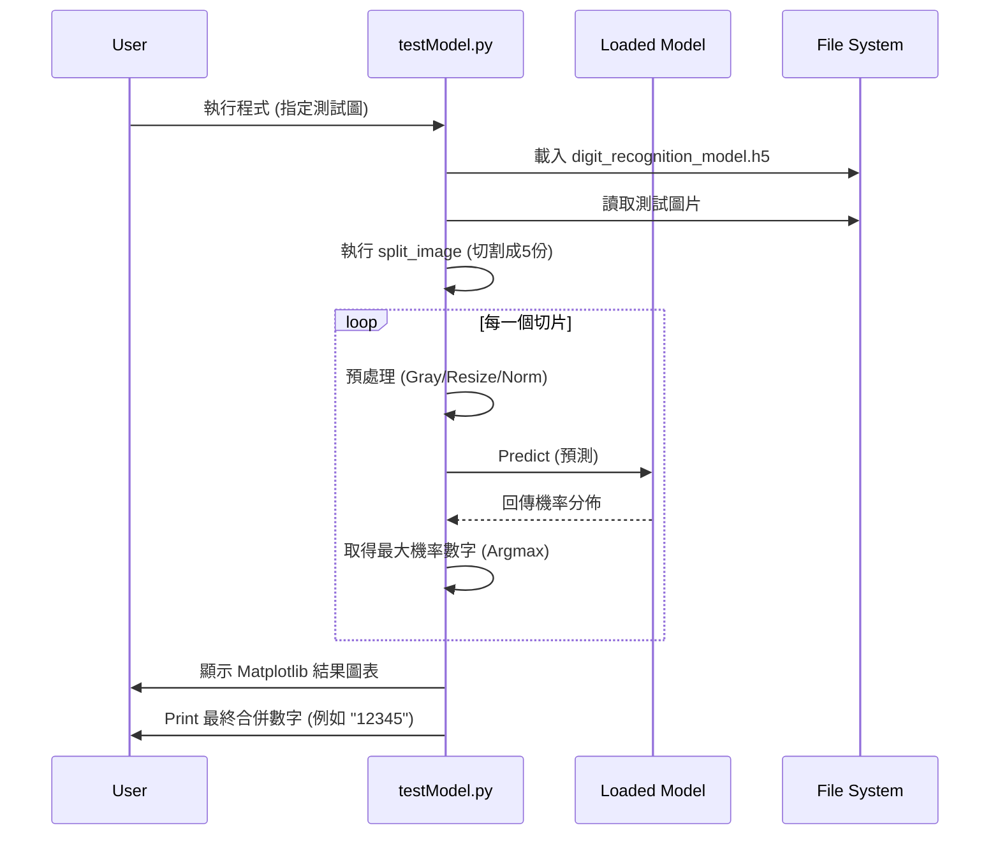

# CNN Digit Recognition System (五碼數字辨識系統)

## 專案總覽 (Project Overview)
本專案是一個基於卷積神經網路 (CNN) 的數字辨識系統，專門設計用於辨識特定格式的圖片（例如水錶或電錶的五位數讀數）。系統包含完整的訓練流程與推論展示工具。

- **專案用途**：自動化識別含有 5 位數字的圖片。
- **解決的問題**：將特定裁切範圍內的影像數據轉換為數位格式。
- **使用對象**：開發者、數據分析師或自動化與 IoT 串接人員。
- **專案性質**：Service / Tool (機器學習模型訓練與推論工具)。

---

## 系統架構說明 (Architecture Overview)

本系統分為「訓練 (Training)」與「推論 (Inference)」兩大階段。核心採用 TensorFlow/Keras 建立的 CNN 模型。

### 模組職責
- **Data Preprocessing**: 負責將原始大圖依據固定座標切割為 5 等份，並進行灰階化與正規化。
- **CNN Model**: 卷積神經網路，負責特徵提取與數字分類 (0-9)。
- **Storage**: 儲存處理後的圖片 (`processed_images`) 與訓練好的模型 (`.h5`)。

### 系統架構圖


---

## 系統流程說明 (System Flow)

### 1. 訓練流程 (Training Pipeline) - `cnn.py`
程式會讀取 `dataset_folder` 中的圖片，根據檔名解析出正確答案 (Label)，切割後即時餵入模型進行訓練。



### 2. 推論流程 (Inference Pipeline) - `testModel.py`
載入已訓練的模型，對單張測試圖片進行相同的切割與處理，最後輸出五位數結果並顯示信心分數。



---

## 資料夾結構說明 (Folder Structure)

```text
.
├── cnn.py                      # [核心] 模型訓練腳本
├── testModel.py                # [核心] 模型測試與推論腳本
├── test.py                     # [工具] GPU 環境測試工具
├── digit_recognition_model.h5  # [產出] 訓練完成的模型檔
├── dataset_folder/             # [資料] 存放原始訓練圖片
├── processed_images/           # [中間產物] cnn.py 執行過中產生的切割圖片
├── split_images/               # [中間產物] testModel.py 執行時產生的測試切片
└── README.md                   # 專案說明文件
```

---

## 核心模組與重要檔案 (Key Modules & Files)

| 檔案名稱 | 類型 | 職責與功能 | 關聯模組 |
|:--- |:--- |:--- |:--- |
| **cnn.py** | Training Script | 定義 CNN 架構、讀取 `dataset_folder`、執行圖片切割資料擴增、訓練並儲存模型。 | `dataset_folder`, `processed_images` |
| **testModel.py** | Inference Script | 載入 `.h5` 模型、讀取單張圖片進行預測、使用 Matplotlib 繪製結果。 | `digit_recognition_model.h5`, `split_images` |
| **dataset_folder/** | Directory | 放置訓練用的原始圖片。檔名格式嚴格要求：`前綴_時間戳_標籤數字.jpg` (程式會取第3部分作為 Label)。 | 被 `cnn.py` 讀取 |

---

## 安裝與環境需求 (Installation & Requirements)

### 系統需求
- **OS**: Windows (目前環境) / Linux / macOS
- **Python Version**: 3.8+

### 核心相依套件 (Dependencies)
請確保安裝以下 Python 套件：
```bash
pip install tensorflow numpy opencv-python matplotlib pillow
```

### 環境變數
- 本專案主要依賴相對路徑，無需設定特殊環境變數。
- 若有 GPU，`tensorflow` 會自動偵測 (可使用 `test.py` 驗證)。

---

## 使用方式 (How to Use)

### 1. 準備訓練資料
將原始圖片放入 `dataset_folder` 中。
- **檔名命名規則**：必須包含三個透過底線 `_` 分隔的區塊，例如 `DeviceA_20230101_12345.jpg`。
    - 程式邏輯：`filename.split("_")[2]` 被視為正確答案 (Label string)。

### 2. 訓練模型
執行以下指令開始訓練：
```bash
python cnn.py
```
- 程式會自動切割圖片並儲存至 `processed_images`。
- 訓練完成後會生成 `digit_recognition_model.h5`。

### 3. 執行測試 (推論)
修改 `testModel.py` 中的 `test_image_path` 變數指向你想測試的圖片，然後執行：
```bash
python testModel.py
```
- 將會跳出視窗顯示 5 張切割圖及其預測結果。
- Console 會印出最終辨識出的數字串。

---

## 設定說明 (Configuration)

本專案將設定直接寫於程式碼開頭的變數中，主要可調整項目如下：

### cnn.py
```python
input_folder = "dataset_folder"      # 訓練資料來源
output_folder = "processed_images"   # 切割圖存檔區
model_path = "digit_recognition_model.h5"
# 切割參數 (位於 split_image 函式內)
start, end, num_slices = 7, 83, 5    # X 軸切割起始點與份數
```

### testModel.py
```python
test_image_path = "..."              # 指定要測試的圖片路徑
rcParams['font.family'] = 'Microsoft JhengHei' # 圖表字型設定
```

---

## 開發者指南 (Developer Guide)

### 建議閱讀順序
1. **`cnn.py` 圖像處理函式**：理解 `split_image` 如何運作，這是資料正確性的關鍵。
2. **`cnn.py` 模型架構**：目前的 CNN 為 2 層 Conv2D + 2 層 Dense，可視需求加深。
3. **`testModel.py`**：理解如何載入模型並對新資料進行相同的預處理。

### 修改注意事項
- **切割座標 (Hardcoded Crops)**：目前的切割範圍 `start=7, end=83` 是寫死的。若更換攝影機角度或圖片解析度改變，**必須**重新校正這些數值，否則數字會被切壞。
- **檔名依賴**：訓練資料的 Label 來自檔名解析，請勿隨意更改訓練圖片的命名格式。

---

## 已知限制與待辦事項 (Limitations & TODO)

### 限制 (Limitations)
1. **固定解析度與位置**：極度依賴輸入圖片的特定格式與數字位置，缺乏定位 (Localization) 機制（如 YOLO）。如果數字偏移，識別率會大幅下降。
2. **訓練方式**：目前採用「逐檔讀取 -> 切割 -> Fit」的迴路，而非標準的「準備好所有 Dataset -> Model.fit」。若資料量變大，效率可能不佳。

### 待辦事項 (TODO)
- [ ] 將切割參數 (`start`, `end`) 提取至設定檔，避免 Hardcode。
- [ ] 加入自動定位數字區域的功能 (由固定切割改為動態偵測)。
- [ ] 優化訓練 Pipeline，支援 Batch Loading 以提升訓練效率。
